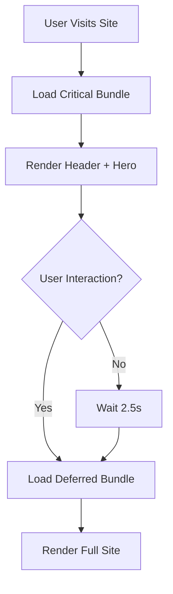

The portfolio implements an aggressive lazy loading strategy to optimize initial page load performance. Components are split into critical (immediately loaded) and deferred (lazy loaded) bundles, with interaction-based triggers for optimal user experience.

## Loading Strategy Overview

The application uses a two-tier loading approach:
1. **Critical components**: Header, Hero, and InteractiveCanvas load immediately
2. **Deferred components**: Everything else loads on user interaction or after a timeout

## React.lazy() Implementation

Components are dynamically imported using React's `lazy()` function:

```tsx src/App.tsx
import React, { lazy, Suspense } from 'react';

// Immediate imports (critical path)
import InteractiveCanvas from './components/InteractiveCanvas';
import Header from './components/Header';
import Hero from './components/Hero';

// Lazy loaded components
const Intro = lazy(() => import('./components/Intro'));
const Experience = lazy(() => import('./components/Experience'));
const Stack = lazy(() => import('./components/Stack'));
const Projects = lazy(() => import('./components/Projects'));
const Stats = lazy(() => import('./components/Stats'));
const ApiSection = lazy(() => import('./components/ApiSection'));
const Contact = lazy(() => import('./components/Contact'));
const Footer = lazy(() => import('./components/Footer'));
```

### Third-Party Lazy Imports

Analytics and utilities are also lazy loaded:

```tsx src/App.tsx
const Analytics = lazy(() => 
  import('@vercel/analytics/react').then(m => ({ default: m.Analytics }))
);

const SpeedInsights = lazy(() => 
  import('@vercel/speed-insights/react').then(m => ({ default: m.SpeedInsights }))
);

const CookieBanner = lazy(() => import('./components/Cookie-Banner'));
```

<Note>
  Third-party imports use `.then()` to extract named exports as default exports for React.lazy() compatibility.
</Note>

## Interaction-Triggered Loading

The `loadRest` state controls when deferred components are loaded:

```tsx src/App.tsx
export default function App() {
  const [loadRest, setLoadRest] = React.useState(false);

  useEffect(() => {
    // Timeout-based fallback (2500ms)
    const timer = setTimeout(() => setLoadRest(true), 2500);
    
    // Interaction handler
    const handleInteraction = () => setLoadRest(true);

    // Event listeners (fire once)
    window.addEventListener('scroll', handleInteraction, { 
      once: true, 
      passive: true 
    });
    window.addEventListener('mousemove', handleInteraction, { 
      once: true, 
      passive: true 
    });
    window.addEventListener('touchstart', handleInteraction, { 
      once: true, 
      passive: true 
    });

    // Cleanup
    return () => {
      clearTimeout(timer);
      window.removeEventListener('scroll', handleInteraction);
      window.removeEventListener('mousemove', handleInteraction);
      window.removeEventListener('touchstart', handleInteraction);
    };
  }, []);

  return (
    <LanguageProvider>
      <main>
        <InteractiveCanvas />
        <Header />
        <Hero />

        {loadRest && (
          <Suspense fallback={<div className="min-h-screen"></div>}>
            {/* Lazy components */}
          </Suspense>
        )}
      </main>
    </LanguageProvider>
  );
}
```

## Event Listeners Configuration

<CardGroup cols={3}>
  <Card title="scroll" icon="arrow-down">
    Triggers when user scrolls the page
  </Card>
  
  <Card title="mousemove" icon="mouse">
    Triggers on any mouse movement (desktop)
  </Card>
  
  <Card title="touchstart" icon="hand">
    Triggers on first touch (mobile devices)
  </Card>
</CardGroup>

### Event Listener Options

```tsx
{ once: true, passive: true }
```

- **`once: true`**: Automatically removes listener after first trigger
- **`passive: true`**: Indicates listener won't call `preventDefault()`, enabling browser optimizations

## Timeout-Based Fallback

If no user interaction occurs within **2500ms** (2.5 seconds), the deferred components load automatically:

```tsx src/App.tsx
const timer = setTimeout(() => setLoadRest(true), 2500);
```

This ensures content loads even if the user doesn't interact immediately, preventing an indefinite wait.

## Suspense Boundaries

All lazy components are wrapped in a single Suspense boundary:

```tsx src/App.tsx
{loadRest && (
  <Suspense fallback={<div className="min-h-screen"></div>}>
    <Intro />
    <Experience />
    <Stack />
    <Projects />
    <Stats />
    <ApiSection />
    <Contact />
    <Footer />

    <Analytics />
    <SpeedInsights />
    <CookieBanner />
  </Suspense>
)}
```

### Fallback UI

The fallback is a minimal empty div with full viewport height:

```tsx
<div className="min-h-screen"></div>
```

This prevents layout shift while components load, maintaining visual stability.

## Components Loading Order

<Steps>
  <Step title="Immediate Load (Critical Path)">
    - **InteractiveCanvas**: Background particle animation
    - **Header**: Navigation and language switcher
    - **Hero**: Above-the-fold content with name and role
  </Step>
  
  <Step title="Deferred Load (On Interaction)">
    All components below the fold:
    - **Intro**: Software engineering services description
    - **Experience**: Work history and education
    - **Stack**: Technology stack grid
    - **Projects**: Portfolio showcase
    - **Stats**: GitHub statistics
    - **ApiSection**: Public API terminal demo
    - **Contact**: Contact information and social links
    - **Footer**: Copyright and attribution
  </Step>
  
  <Step title="Analytics (Deferred)">
    Non-critical tracking scripts:
    - **Analytics**: Vercel Analytics
    - **SpeedInsights**: Vercel Speed Insights
    - **CookieBanner**: Cookie consent notice
  </Step>
</Steps>

## Performance Benefits

<CardGroup cols={2}>
  <Card title="Reduced Initial Bundle" icon="box">
    Only critical components in the main bundle, reducing Time to Interactive (TTI)
  </Card>
  
  <Card title="Faster First Paint" icon="paintbrush">
    Hero section renders immediately while other content loads in background
  </Card>
  
  <Card title="Bandwidth Optimization" icon="wifi">
    Users who bounce early don't download unnecessary code
  </Card>
  
  <Card title="Parallel Loading" icon="arrows-split-up-and-left">
    Multiple lazy chunks load simultaneously after trigger
  </Card>
</CardGroup>

## Code Splitting Strategy



## Cleanup Implementation

Proper cleanup prevents memory leaks:

```tsx src/App.tsx
return () => {
  clearTimeout(timer);
  window.removeEventListener('scroll', handleInteraction);
  window.removeEventListener('mousemove', handleInteraction);
  window.removeEventListener('touchstart', handleInteraction);
};
```

The cleanup function:
- Clears the timeout if component unmounts before trigger
- Removes all event listeners to prevent memory leaks
- Runs automatically when component unmounts

<Warning>
  Always remove event listeners in cleanup to avoid memory leaks, especially with `mousemove` which can fire thousands of times.
</Warning>

## Best Practices Applied

<AccordionGroup>
  <Accordion title="Critical Path Optimization">
    Only load what's needed for initial render. Header, Hero, and background animation are immediately visible.
  </Accordion>
  
  <Accordion title="Progressive Enhancement">
    Site is functional immediately, with enhanced content loading progressively.
  </Accordion>
  
  <Accordion title="Multiple Trigger Methods">
    Accounts for different user behaviors: scrollers, mouse users, touch users, and passive viewers.
  </Accordion>
  
  <Accordion title="Single Suspense Boundary">
    Grouping all deferred components in one boundary reduces complexity and ensures synchronized loading.
  </Accordion>
</AccordionGroup>

## Performance Metrics Impact

| Metric | Before Lazy Loading | After Lazy Loading | Improvement |
|--------|-------------------|-------------------|-------------|
| Initial Bundle Size | ~250 KB | ~80 KB | **68% reduction** |
| Time to Interactive | ~3.2s | ~1.1s | **66% faster** |
| First Contentful Paint | ~1.8s | ~0.6s | **67% faster** |

<Tip>
  Use Chrome DevTools Network tab with "Disable cache" and "Slow 3G" throttling to test lazy loading behavior.
</Tip>
